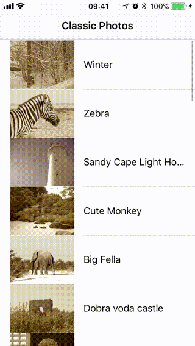
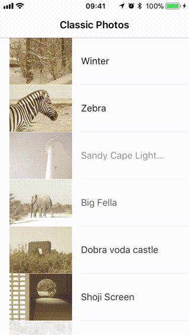

# Ray Wenderlich Operation Tutorial and Advanced Operation Sample

    
    
    
        </a>
    </a>
    

## Advanced Operation Sample in Swift

This is a sample code of using Advanced operation in swift.

The base sample code is taken from [NSOperation and NSOperationQueue Tutorial in Swift - Ray Wenderlich](https://www.raywenderlich.com/76341/use-nsoperation-nsoperationqueue-swift) and rewrited with using Advanced operation library of [Advanced NSOperations - WWDC 2015 - Session 226](https://developer.apple.com/videos/play/wwdc2015/226/).

## Demo
### The Starter Project

### The Ray Wenderlich Version Completed project

### The Advanced Operation Version Completed Project

## How to use This Sample
### For learning
First of all, if you haven't enough expriment about using operations in swift, have a look to raywenderlich tutorial. the starter and completed sample codes of [raywenderlich tutorial](https://www.raywenderlich.com/76341/use-nsoperation-nsoperationqueue-swift) are exist in this sample codes for comparing with advanced operation library using. they are updated to swift 4 syntax and you can use the if you want some help.

Next compare ClassicPhotos with Advanced Operation and 
raywenderlich tutorial. look at differents in codes and runing. for more information about using advanced operation watch [Advanced NSOperations - WWDC 2015 - Session 226 Video](https://developer.apple.com/videos/play/wwdc2015/226/).

You will see:

* How the code is encapsulated and more readable and more understandable. You can detect easily what is the duty of each file and even each method.

* How loading images and their filtering is speeded up and being more efficient.

*  Notice that the app improvement isn't cause just using advanced Operations, I converted `PhotoRecord` class to struct. It was effective to improvement the app too. Look how I updated `photos` arrray in `ListViewController` after receiving details from internet or after downloading or filtering images. I used protocol for this. Also I used `URLSession` instead of simple `Data` for downloading images.

### for using in your project

just import the `Operations` folder inside the ClassicPhotos-Advanced-Operation Folder in to your project and use it.
Although this not a complete version of Advanced Operation library. you can download complete one from [Advanced NSOperations - WWDC 2015 - Session 226 sample code](https://developer.apple.com/sample-code/wwdc/2015/downloads/Advanced-NSOperations.zip).

I hope this sample code will be useful to you.